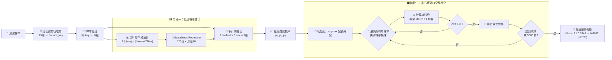

# GEM-F1 贪心期望宏平均F1推理优化框架

```mermaid
flowchart LR
    A["📂 测试样本"] --> B["🔗 组合键特征哈希<br/>15维 → feature_key"]
    B --> C["👥 样本分组<br/>同 key → 同组"]

    subgraph P1["🟦 阶段一：组级概率估计"]
        D["📊 贝叶斯平滑统计<br/>P(c|key) = (N+απ)/(ΣN+α)"]
        E["🌲 ExtraTrees Regressor<br/>120树 × 深度16"]
        F["🔀 多计划融合<br/>3 holdout × 3 stat = 9组"]
    end

    C --> D
    D --> E
    C --> F
    E --> F
    F --> G["📈 组级类别概率<br/>p₀, p₁, p₂"]

    subgraph P2["🟧 阶段二：贪心期望F1全局优化"]
        H["🎯 初始化：argmax 配额分配"]
        I{"🔄 遍历所有单样本<br/>类别转移操作"}
        J["📐 计算转移后<br/>期望 Macro F1 增益"]
        K{"ΔF1 > 0 ?"}
        L["✅ 执行最优转移"]
        M{"达到收敛<br/>或 5000 步?"}
    end

    G --> H
    H --> I
    I --> J
    J --> K
    K -->|是| L
    K -->|否| I
    L --> M
    M -->|否| I
    M -->|是| N["🏁 输出最终标签<br/>Macro F1 0.6346 → 0.6802 (+7.2%)"]
```
