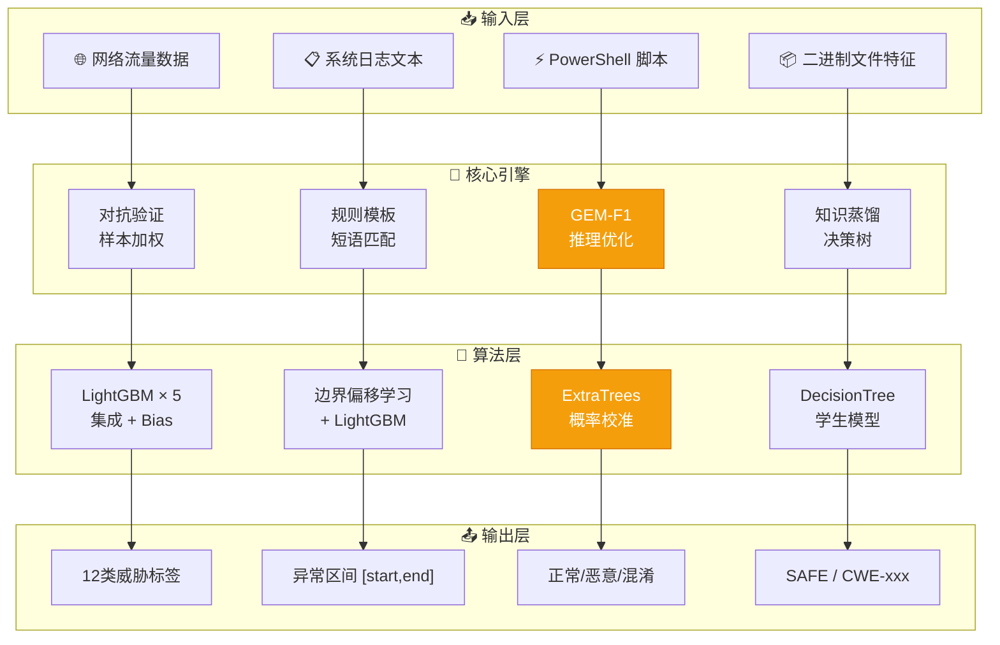

# 系统整体架构

```mermaid
flowchart TB
    subgraph Input["📥 输入层"]
        A1["🌐 网络流量数据"]
        A2["📋 系统日志文本"]
        A3["⚡ PowerShell 脚本"]
        A4["📦 二进制文件特征"]
    end

    subgraph core["🧠 核心引擎"]
        direction LR
        B1["对抗验证<br/>样本加权"]
        B2["规则模板<br/>短语匹配"]
        B3["GEM-F1<br/>推理优化"]
        B4["知识蒸馏<br/>决策树"]
    end

    subgraph models["🤖 算法层"]
        direction LR
        C1["LightGBM × 5<br/>集成 + Bias"]
        C2["边界偏移学习<br/>+ LightGBM"]
        C3["ExtraTrees<br/>概率校准"]
        C4["DecisionTree<br/>学生模型"]
    end

    subgraph output["📤 输出层"]
        D1["12类威胁标签"]
        D2["异常区间 [start,end]"]
        D3["正常/恶意/混淆"]
        D4["SAFE / CWE-xxx"]
    end

    A1 --> B1 --> C1 --> D1
    A2 --> B2 --> C2 --> D2
    A3 --> B3 --> C3 --> D3
    A4 --> B4 --> C4 --> D4

    style B3 fill:#f59e0b,stroke:#d97706,color:#fff
    style C3 fill:#f59e0b,stroke:#d97706,color:#fff
```
