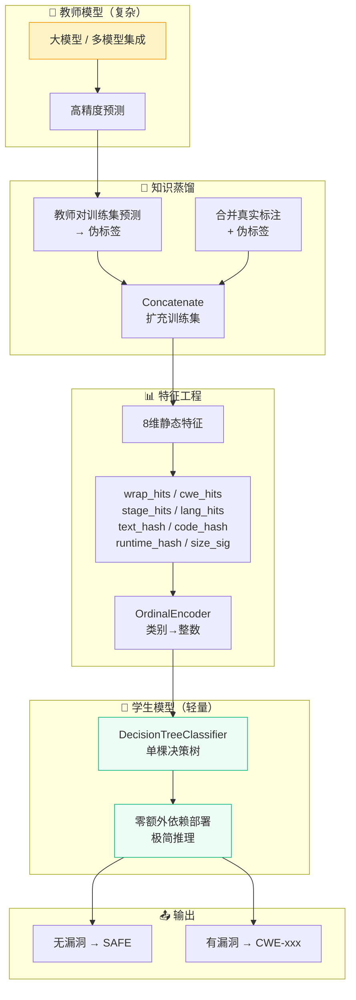

# 知识蒸馏流程

```mermaid
flowchart TB
    subgraph teacher["🧠 教师模型（复杂）"]
        T1["大模型 / 多模型集成"]
        T2["高精度预测"]
    end

    subgraph distill["🔄 知识蒸馏"]
        D1["教师对训练集预测<br/>→ 伪标签"]
        D2["合并真实标注<br/>+ 伪标签"]
        D3["Concatenate<br/>扩充训练集"]
    end

    subgraph features["📊 特征工程"]
        F1["8维静态特征"]
        F2["wrap_hits / cwe_hits<br/>stage_hits / lang_hits<br/>text_hash / code_hash<br/>runtime_hash / size_sig"]
        F3["OrdinalEncoder<br/>类别→整数"]
    end

    subgraph student["🌳 学生模型（轻量）"]
        S1["DecisionTreeClassifier<br/>单棵决策树"]
        S2["零额外依赖部署<br/>极简推理"]
    end

    subgraph output["📤 输出"]
        O1["无漏洞 → SAFE"]
        O2["有漏洞 → CWE-xxx"]
    end

    T1 --> T2
    T2 --> D1
    D1 --> D3
    D2 --> D3
    D3 --> F1
    F1 --> F2
    F2 --> F3
    F3 --> S1
    S1 --> S2
    S2 --> O1
    S2 --> O2

    style T1 fill:#fef3c7,stroke:#f59e0b
    style S1 fill:#ecfdf5,stroke:#10b981
    style S2 fill:#ecfdf5,stroke:#10b981
```
