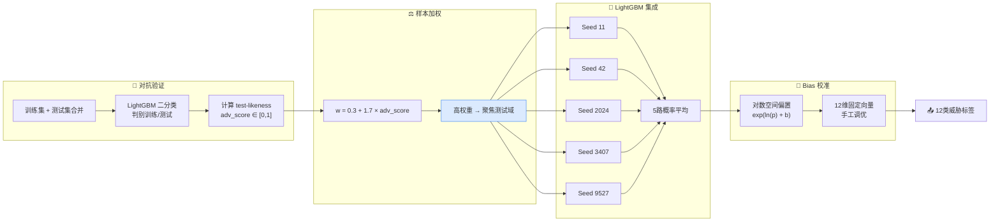

# 网络流量安全智能分类流程

```mermaid
flowchart LR
    subgraph av["🔄 对抗验证"]
        A1["训练集 + 测试集合并"]
        A2["LightGBM 二分类<br/>判别训练/测试"]
        A3["计算 test-likeness<br/>adv_score ∈ [0,1]"]
    end

    subgraph weight["⚖️ 样本加权"]
        B1["w = 0.3 + 1.7 × adv_score"]
        B2["高权重 → 聚焦测试域"]
    end

    subgraph ensemble["🌲 LightGBM 集成"]
        C1["Seed 11"]
        C2["Seed 42"]
        C3["Seed 2024"]
        C4["Seed 3407"]
        C5["Seed 9527"]
        C6["5路概率平均"]
    end

    subgraph bias["📏 Bias 校准"]
        D1["对数空间偏置<br/>exp(ln(p) + b)"]
        D2["12维固定向量<br/>手工调优"]
    end

    A1 --> A2 --> A3
    A3 --> B1 --> B2
    B2 --> C1
    B2 --> C2
    B2 --> C3
    B2 --> C4
    B2 --> C5
    C1 --> C6
    C2 --> C6
    C3 --> C6
    C4 --> C6
    C5 --> C6
    C6 --> D1 --> D2 --> E["📤 12类威胁标签"]

    style B2 fill:#dbeafe,stroke:#3b82f6
```
